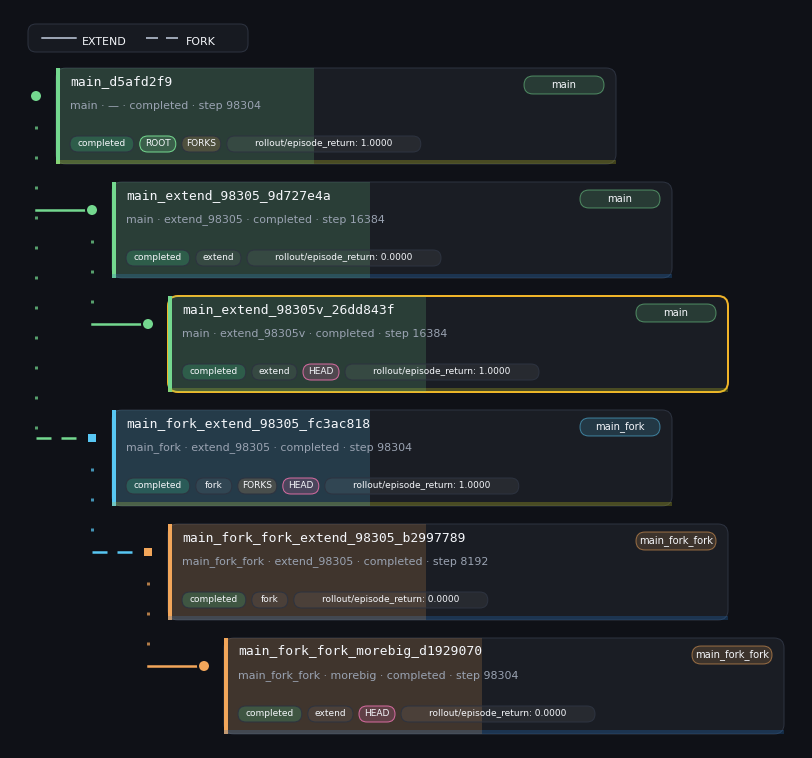

<div align="center">


</div>

---

<p align="center"><strong>Judgment-Augmented Reinforcement Learning</strong></p>

<p align="center"><a href="README.es.md">Español</a> · <strong>English</strong></p>

<div align="center">

[](https://www.python.org/)
[](https://github.com/astral-sh/ruff)
[](https://github.com/astral-sh/uv)
[](https://github.com/pre-commit/pre-commit)
[](LICENSE)

</div>

JARL is a Python package with a modular architecture for reinforcement learning experiments supervised by a tutor agent based on language models.

The package combines training, persistence, and agentic tools. Its experiment management layer draws on Git concepts to store training branches, configurations, metrics, checkpoints, and artifacts. Each intervention remains traceable to the training run where it occurred.

<div align="center">



</div>

## ✨ What JARL can do

- Create, resume, branch, and compare training runs without losing their lineage.
- Train PPO and PPO-GRU agents on Navix with JAX.
- Inspect metrics, checkpoints, and rollouts from Runner Lab.
- Let a tutor agent apply controlled changes to rewards, hyperparameters, and tasks.
- Use the same operations from Python, the command line, or an MCP client.

## 🚀 Quick start

Follow the [installation guide](docs/install.md), then check which device JAX will use:

```bash
uv run python -c "import jax; print(jax.default_backend()); print(jax.devices())"
```

Start Runner Lab:

```bash
make app
```

`make help` lists the available commands. `make check` runs the quality checks, and `make test` runs the test suite.

## 🤖 Language models and MCP

Agentic features require either a local model served by Ollama or an OpenAI-compatible API. Remote APIs require an API key from the provider. MCP access runs through a compatible client such as Cursor, Codex, or Claude Code. The [installation guide](docs/install.md) covers the basic requirements and configuration.

## 📚 Documentation

- [Installation](docs/install.md)
- [MCP server](docs/development/mcp.md)

## 📄 License

JARL is available under the [MIT license](LICENSE).
